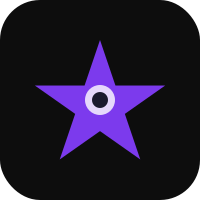

<p align="center">
  
</p>

# StarGazed: The Autonomous Mobile Frontier

StarGazed is an AI-powered assistant designed for autonomous mobile device control. It bridges the gap between high-level LLM reasoning and low-level Android UI interactions using an Accessibility Service and a dedicated Node.js orchestration layer.

## Project Overview

StarGazed enables a direct loop between screen perception and action execution. By leveraging the Android Accessibility API, the system can "see" the screen layout, which is then processed by Google Gemini to perform intelligent actions on behalf of the user.

### Features
- Real-time UI Interaction: High-speed gesture injection including taps, swipes, and scrolls.
- Voice Autonomous Agent: Wake-word detection and voice-driven command execution.
- Multimodal Intelligence: Powered by Google Gemini 1.5 Flash and 2.0 Flash.
- Low Latency: Persistent WebSocket communication for fluid performance.

## Project Structure

```text
star-gazer/
├── android/   # Android client application (Kotlin)
└── backend/   # Node.js orchestration server (Google GenAI)
```

## Installation Guide

### Backend Setup
1. Navigate to the backend directory:
   ```bash
   cd backend
   ```
2. Install dependencies:
   ```bash
   npm install
   ```
3. Create a .env file and add your Gemini API Key:
   ```env
   GEMINI_API_KEY=your_api_key_here
   PORT=8080
   ```
4. Start the server:
   ```bash
   npm start
   ```

### Android Setup
1. Open the `android` folder in Android Studio.
2. Build and install the APK on your device or emulator.
3. Enable the **StarGazed Accessibility Service** in System Settings -> Accessibility.
4. Grant Microphone permissions to enable voice commands.
5. Ensure the device is on the same network or can reach the backend URL (configured in `StarGazedAccessibilityService.kt`).

## Use Cases

### Workflow Automation
Automate repetitive mobile tasks such as data entry in legacy applications, social media management, or complex system configurations through simple voice or text prompts.

### Advanced Accessibility
Empower users with limited motor function to navigate any Android application using natural language commands, circumventing difficult UI patterns.

### Intelligent Personal Assistant
Bridge the gap between information retrieval and execution. Instead of just asking for a restaurant, have the assistant open the app and start the booking process.

## Tech Stack
- Android: Kotlin, Accessibility Service, SpeechRecognizer, OkHttp.
- Backend: Node.js, Express, WebSockets.
- AI: Google Gemini API (@google/genai).
- Environment: Containerized with Docker.

---
*Inspired by the vision of a truly autonomous personal assistant.*
